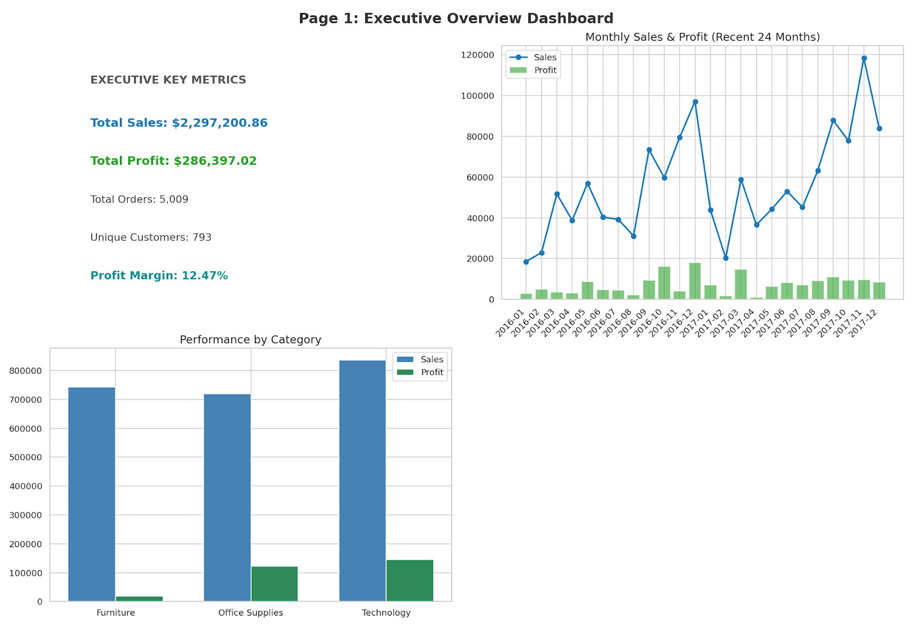
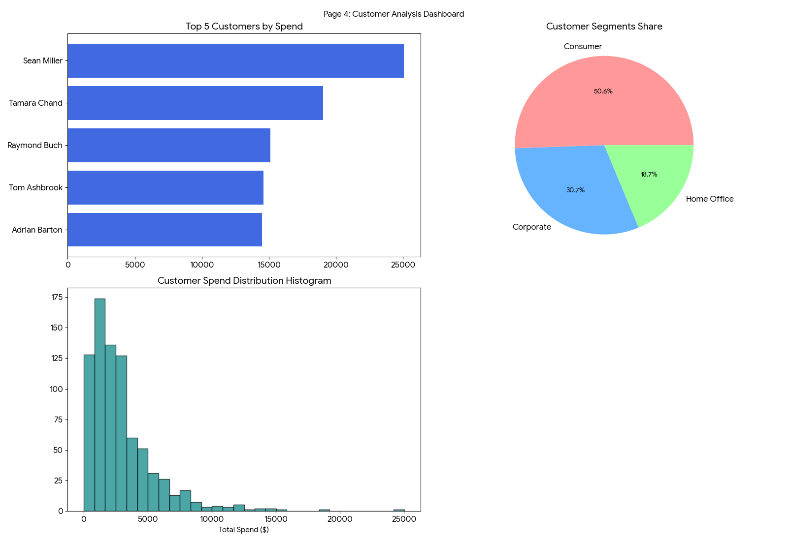
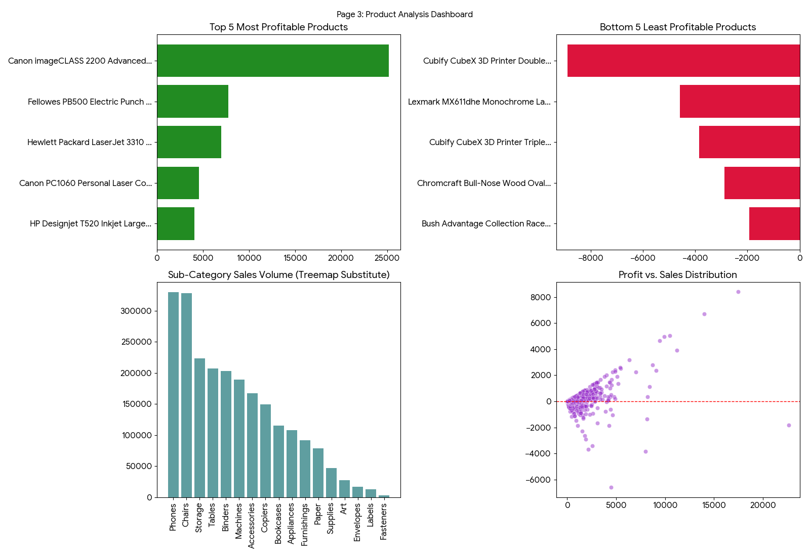
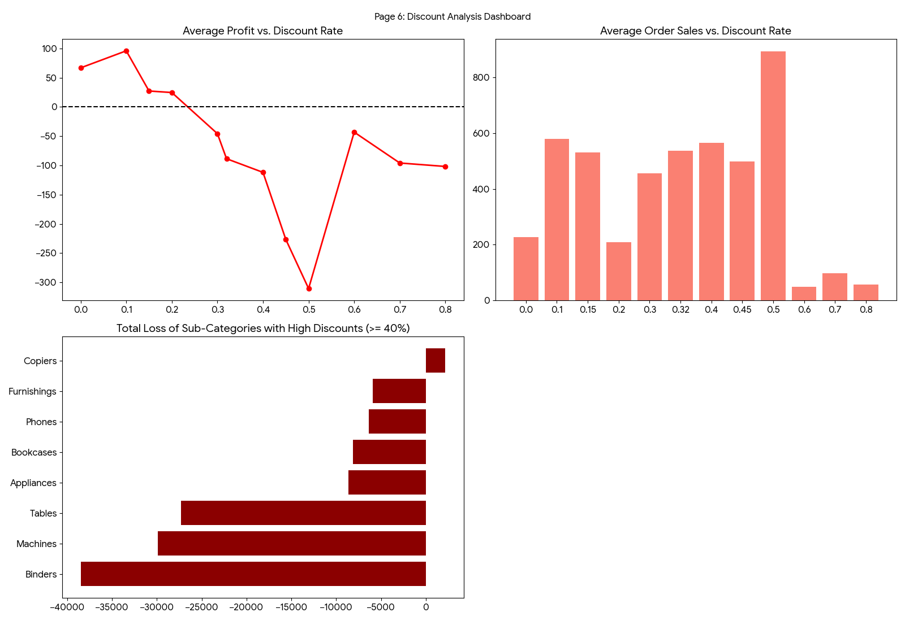
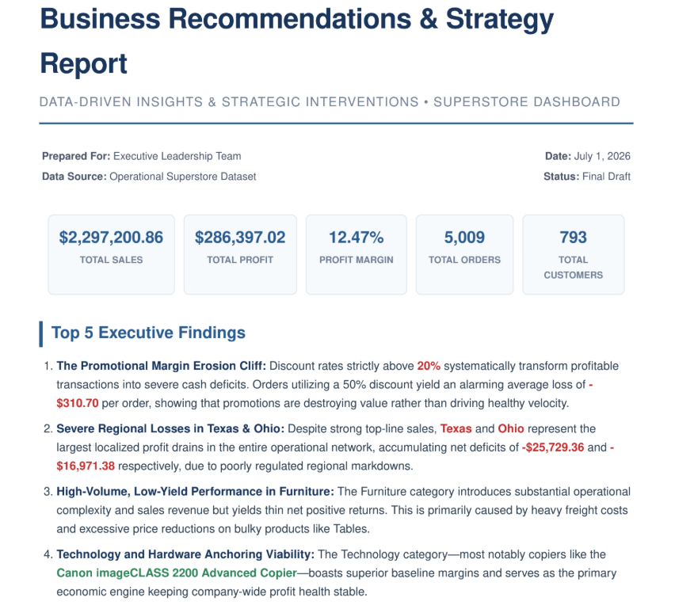

# sales-performance-dashboard
End-to-End Sales Performance Analysis using SQL and Power BI.
# 📈 Sales Performance Dashboard

## 📌 Project Overview

This project analyzes sales performance for a retail company using **SQL** and **Power BI**. The objective is to transform raw transactional data into actionable business insights by examining sales trends, profitability, customer behavior, product performance, regional performance, and discount strategies.

The project follows a complete analytics workflow including data cleaning, feature engineering, KPI calculation, exploratory analysis, dashboard development, and executive business recommendations.

---

# 🎯 Business Problem

The executive leadership team wants to understand:

- How are sales and profits performing over time?
- Which products generate the highest and lowest profits?
- Which customers contribute the most revenue?
- Which regions require operational improvement?
- How do discounts affect profitability?
- What strategic actions can increase profit and improve business performance?

---

# 📊 Dataset

**Dataset:** Sample Superstore

**Records:** ~10,000 retail transactions

### Main Features

- Order Date
- Ship Date
- Customer
- Segment
- Product
- Category
- Sub-Category
- Region
- State
- City
- Sales
- Quantity
- Discount
- Profit

---

# 🛠 Tools Used

- SQL (MySQL)
- Power BI
- Excel

---

# ⚙️ Project Workflow

### 1. Data Cleaning

- Data validation
- Duplicate detection
- Missing value checks
- Data type verification
- Data consistency checks

### 2. Feature Engineering

Created business-friendly fields including:

- Order Year
- Order Month
- Quarter
- Profit Margin
- Sales Band
- Profit Band

### 3. KPI Development

Calculated key business metrics such as:

- Total Sales
- Total Profit
- Total Orders
- Total Customers
- Profit Margin
- Average Order Value
- Average Discount

### 4. Business Analysis

Performed detailed analysis across:

- Sales Performance
- Customer Analysis
- Product Analysis
- Geographic Analysis
- Discount Analysis

---

# 📊 Dashboard Pages

## Executive Overview

- Total Sales
- Total Profit
- Total Orders
- Total Customers
- Profit Margin
- Monthly Sales & Profit Trend
- Sales by Category

---

## Customer Analysis

- Top Customers
- Customer Segments
- Customer Spending
- Customer Contribution

---

## Product Analysis

- Top 5 Most Profitable Products
- Bottom 5 Least Profitable Products
- Sales by Sub-Category
- Profit vs Sales Distribution

---

## Geographic Analysis

- Sales by Region
- Profit by Region
- Top Performing States
- Lowest Performing States

---

## Discount Analysis

- Discount vs Profit
- Discount vs Sales
- Impact of Discounts on Profitability

---

## Executive Recommendations

Strategic recommendations based on analytical findings.

---

# 📈 Key Insights

- Total Sales reached **$2.30M**.
- Overall Profit totaled **$286K**.
- Profit Margin was **12.47%**.
- Technology generated the highest profitability.
- Furniture generated strong sales but relatively low profits.
- Discount rates above **20%** significantly reduced profitability.
- Texas and Ohio recorded the largest regional losses.
- A small number of corporate customers generated a significant share of total revenue.

---

# 💡 Business Recommendations

- Implement a maximum standard discount threshold of **20%**.
- Reduce excessive promotions in loss-making regions.
- Increase investment in high-margin technology products.
- Review or discontinue persistently unprofitable products.
- Improve pricing strategy for bulky furniture products.
- Focus customer retention efforts on high-value corporate accounts.

---

# 📁 Repository Structure

```text
sales-performance-dashboard
│
├── README.md
│
├── SQL
│   ├── 01_data_cleaning.sql
│   ├── 02_feature_engineering.sql
│   ├── 03_kpi_queries.sql
│   ├── 04_sales_analysis.sql
│   ├── 05_customer_analysis.sql
│   ├── 06_product_analysis.sql
│   ├── 07_geographic_analysis.sql
│   ├── 08_discount_analysis.sql
│   └── 09_business_recommendations.sql
│
├── dashboard
│   ├── ExecutiveOverview.png
│   ├── CustomerAnalysis.png
│   ├── ProductAnalysis.png
│   ├── GeographicAnalysis.png
│   ├── DiscountAnalysis.png
│   └── Recommendations.png
│
├── report
│   └── Superstore_Business_Recommendations_Report.pdf
│
└── data
    └── SampleSuperstore.csv
```

---

# 📷 Dashboard Preview

## Executive Overview



---

## Customer Analysis



---

## Product Analysis



---

## Geographic Analysis


---

## Discount Analysis



---

## Executive Recommendations




---

# 📄 Business Report

The complete executive report containing strategic findings, recommendations, and expected business impact is available in the **report** folder.

---

# 💼 Skills Demonstrated

- SQL
- Data Cleaning
- Feature Engineering
- Data Validation
- KPI Development
- Business Intelligence
- Data Visualization
- Power BI
- Business Analysis
- Executive Reporting
- Data Storytelling

---

# 🚀 Business Impact

This analysis helps decision-makers:

- Improve profitability
- Optimize discount strategies
- Identify high-performing products
- Reduce losses in underperforming regions
- Improve customer retention
- Support strategic business planning with data-driven insights

---

# 👨‍💻 Author

**Van Serick Bouanga Latchybou**

Aspiring Data Analyst

📌 Google Data Analytics Professional Certificate

🔗 **LinkedIn:** *https://www.linkedin.com/in/van-serick-bouanga-latchybou-ab06483a8/*

🔗 **GitHub:** *(Add your GitHub profile URL)*


